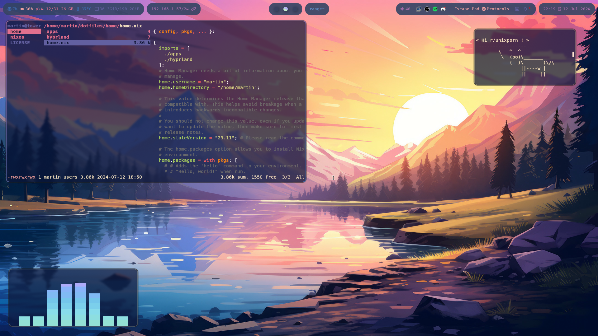
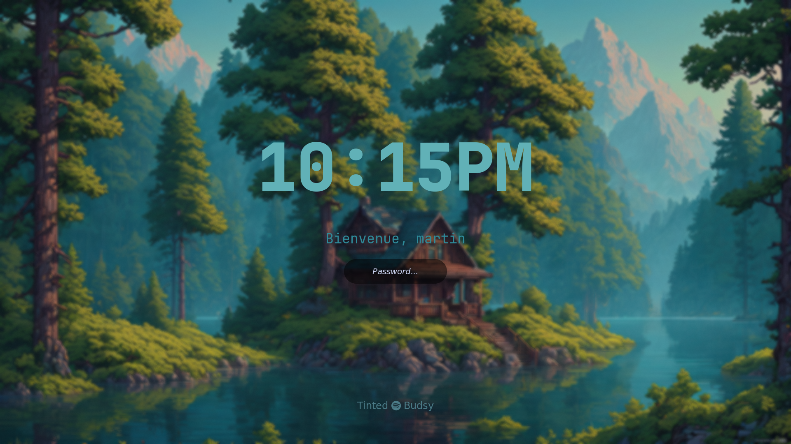

# Nix-dots

Hey there !
Here is my current NixOS configuration.

I'm totally new to nix, so it's far from perfect !

Feel free to tell me about any improvement that you could think of !

## Specifications

- DE : Hyprland
- Bar : Waybar
- Shell : zsh
- Terminal : kitty
- Lockscreen : Hyprlock
- Launchers: Rofi (Wayland)
- Wallpaper manager: swww
- Colorshemes: Pywal

## Screenshots

